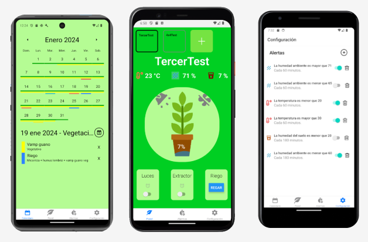

## Hola, mi nombre es Xavier 👋🏼

<table align="right">
 <tr><td><a href="README.md"> English</a></td></tr>
 <tr><td><a href="README_es.md"> Español</a></td></tr>
</table>

<em>Desarrollador en <a href="https://producthackers.com/es/?utm_source=mail&utm_medium=gmail&utm_campaign=firma&utm_term=leandro">Softtek</a></em>

## 🤖 Sobre mi

🛠️ &nbsp; &nbsp; Llevo programando desde 2019 con más de 3 años de experiencia en desarrollo de software para empresas.\
✈️ &nbsp; &nbsp; Nací en Argentina y actualmente vivo en Mar del Plata, provincia de Buenos Aires.\
📱 &nbsp; &nbsp; Tengo pasión por el desarrollo de aplicaciones y siempre estoy buscando nuevos retos.\
🏠 &nbsp; &nbsp; Soy un gran fan del IOT y con ello me encanta hacer la vida mas facil cada día .\
📝 &nbsp; &nbsp; Sometimes I add new updates on my [Greenhouse app](https://confiplant.online).\
⭐️ &nbsp; &nbsp; En mi tiempo libre trabajo en un proyecto personal llamada ConfiPlant, podes verlo [aqui](https://play.google.com/store/apps/details?id=com.xavigmp.confiplant&hl=en_US).\
🐶 &nbsp; &nbsp; Me gustan los animales y adoro pasar tiempo con mi perra Luna.

Más sobre mi perra
&nbsp;
&nbsp;

&nbsp;

&nbsp;

## 🔝 Lenguajes más usados

## 🚀 Proyectos destacados

## ✨ ConfiPlant project

